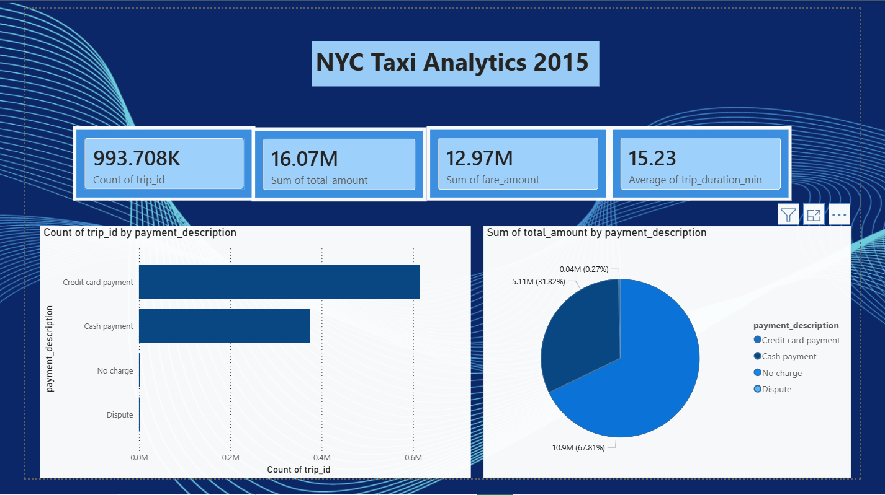
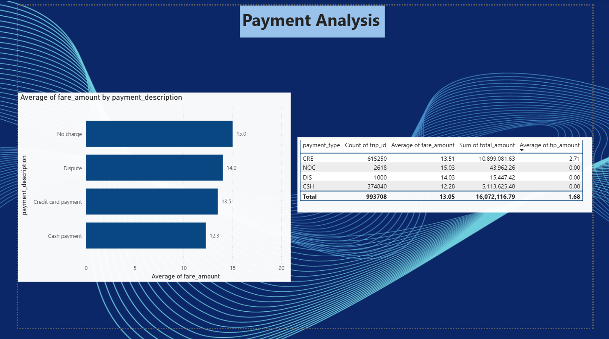
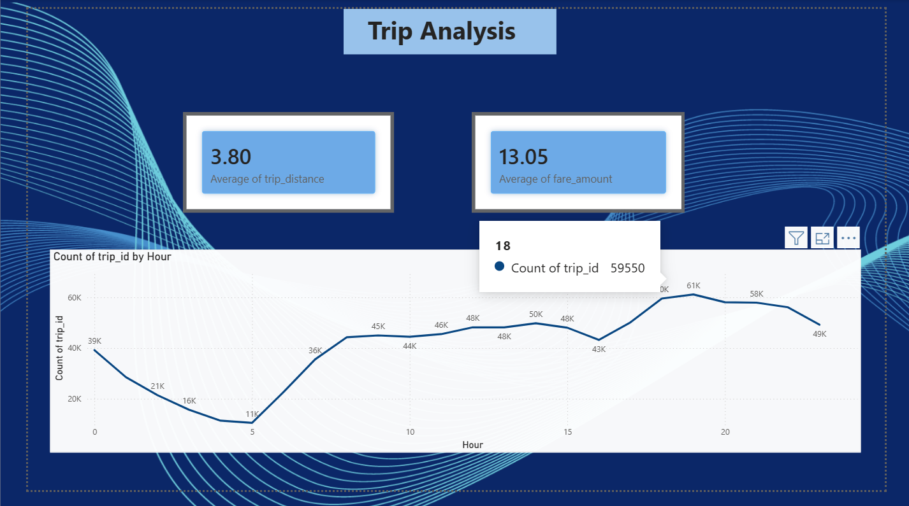
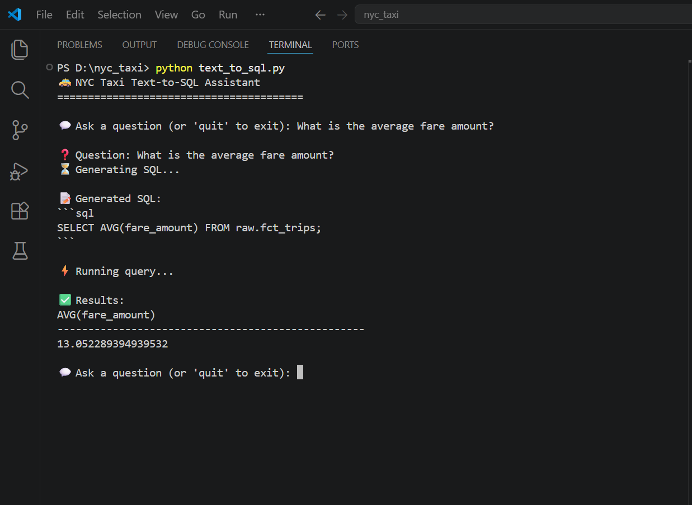
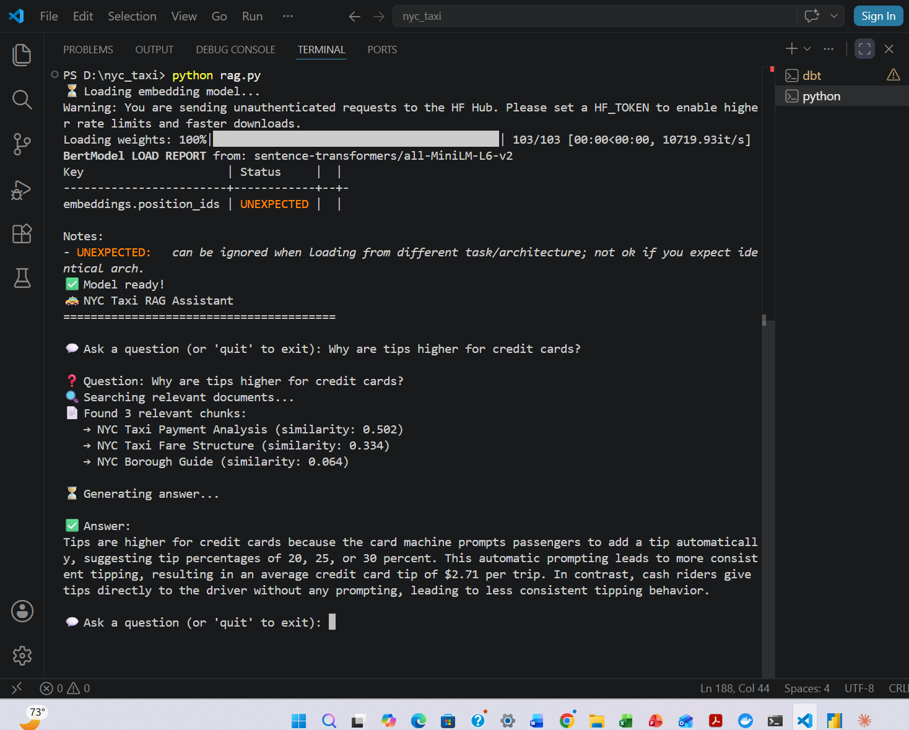
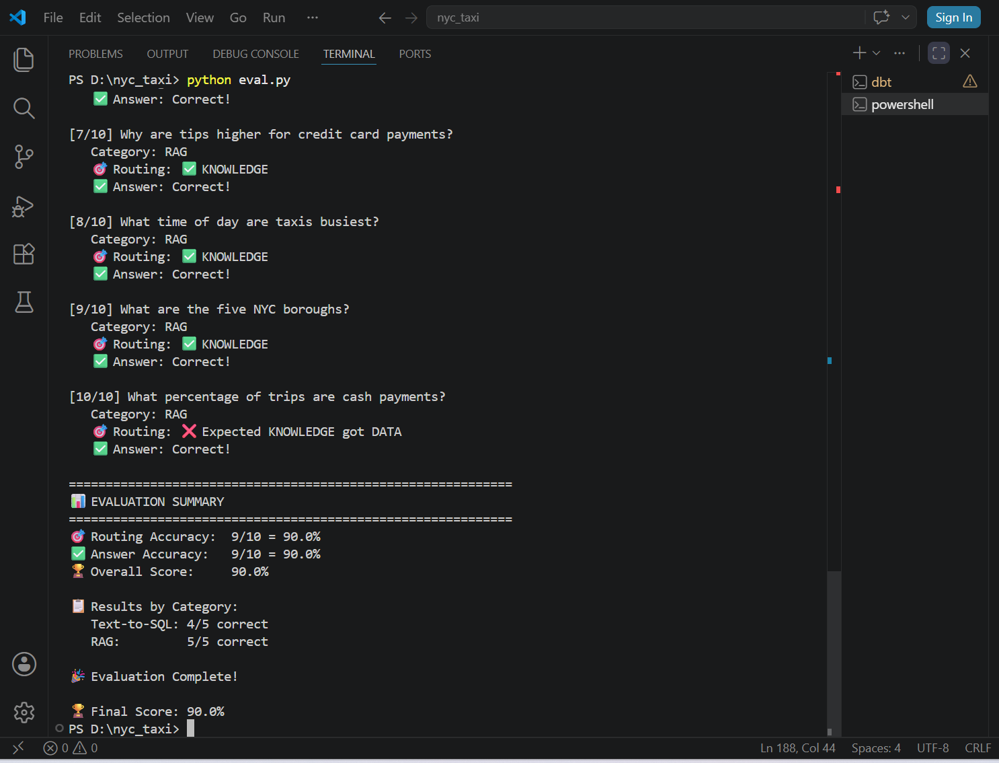

# 🚕 NYC Taxi Data Engineering Project

## 🎯 What I am Building
A complete data engineering pipeline using:
- 🐳 Docker
- 🗄️ ClickHouse (columnar database)
- 🔧 dbt (data transformation)
- 📊 Power BI (dashboards)
- 🤖 AI layer (Text-to-SQL + RAG)

### ⏳ My 14 Day Journey
##✅ Day 1 — Docker + ClickHouse + Data
- Installed Docker Desktop
- Pulled ClickHouse image into Docker
- Created raw database
- Created raw.trips table
- Loaded 1 million real NYC taxi trips
- Ran first analytical SQL queries
- Discovered real business insights!

## ✅ Day 2 — dbt Installed + Connected
- Installed dbt-core 1.11.11
- Installed dbt-clickhouse 1.10.0
- Fixed Windows PATH issue
- Created nyc_taxi dbt project
- Created profiles.yml
- Connected dbt to ClickHouse
- All checks passed!

## ✅ Day 3 — Staging Model Built
- Opened project in VS Code
- Created models/staging/ folder
- Created stg_trips.sql model
- Created sources.yml
- Ran dbt run successfully
- Verified clean data in ClickHouse!

## ⏳ Day 4 — Dimension Tables
- Build dim_payment table
- Build dim_location table

## ⏳ Day 5 — Fact Table
- Build fct_trips table

## ⏳ Day 6 — dbt Tests
- Add tests to models
- Run dbt test

## ⏳ Day 7 — dbt Docs + DAG
- Generate documentation
- Explore DAG diagram

## ⏳ Day 8 — dbt Build
- Run dbt build
- Fix any failures

## ⏳ Day 9 — Power BI Dashboard
- Connect Power BI to ClickHouse
- Build star schema
- Create dashboard

## ⏳ Day 10 — Text-to-SQL Assistant
- Build SQL assistant
- Test with questions

## ⏳ Day 11 — Embeddings Setup
- Create doc chunks table
- Load embeddings

## ⏳ Day 12 — RAG Retrieval
- Build RAG flow
- Test retrieval

## ⏳ Day 13 — Question Router
- Add question router
- Connect RAG + SQL

## ⏳ Day 14 — Evaluation + Documentation
- Run evaluation questions
- Document results
- Project complete! 🎉

- 
## 🛠️ Tech Stack
| Tool | Purpose |
|------|---------|
| Docker | Run ClickHouse locally |
| ClickHouse | Columnar analytics database |
| dbt | Data transformation |
| Power BI | Dashboard and visualization |
| Python | AI and RAG layer |

## 📸 Project Screenshots

### 🎯 Executive Dashboard

### 💳 Payment Analysis

### 🚕 Trip Analysis

### 🗺️ DAG Diagram

### 🤖 Text-to-SQL Demo

### 🧠 RAG Assistant

### 🏆 Evaluation 90% Score

